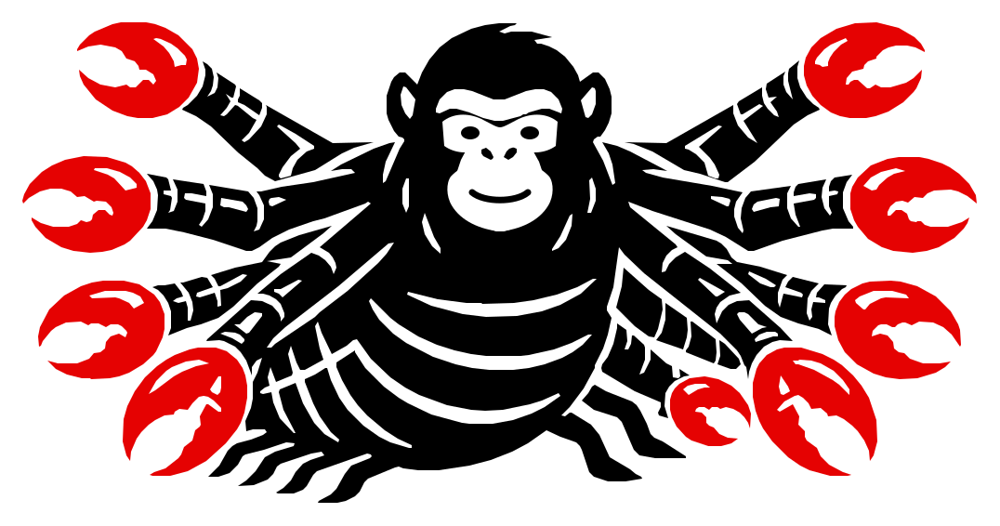

<p align="center">
  <picture>
    <source media="(prefers-color-scheme: dark)" srcset="assets/brand/chimpmaera-negative.svg">
    <source media="(prefers-color-scheme: light)" srcset="assets/brand/chimpmaera-master.svg">
    
  </picture>
</p>

# ChimpMaera v0.1

ChimpMaera v0.1 is a local, synthetic proof of concept for a governed
CRM-to-ERP workflow. The included installer starts an isolated loopback-only
demo with ChimpMaera, EspoCRM and Dolibarr, seeds fictional data, performs one
explicitly governed business action and verifies the result through provider
readback.

This candidate is not a production release, security certification, hosted
service, support promise or permission to connect real systems. It contains no
credentials and should be used only with synthetic data on a disposable or
development host.

## Start here

First read [The ChimpMaera Canon](docs/CANON.md), the laws that define how
agency, authority, effects and evidence relate. Then read
[The Zoo Field Guide](docs/ZOO-FIELD-GUIDE.md) for practical application notes.

Then read [docs/QUICKSTART.md](docs/QUICKSTART.md) and run:

```sh
./demo/install.sh
```

Remove only installer-owned resources with:

```sh
./demo/uninstall.sh --purge
```

The installer never needs production credentials. It creates local random
demo secrets under `.chimpmaera-demo/`; that runtime directory is ignored and
is not part of this release.

## Included areas

- `demo/`: playable installer, local runtime, synthetic fixtures and rollback.
- `assets/brand/`: the public ChimpMaera master mark used by this repository.
- `packages/`: the narrow TypeScript contract/runtime source required by the
  demo image.
- `schemas/`: public machine-readable contracts used by the candidate.
- `tests/`: focused local tests for the governed effect gate and synthetic
  fixture integrity, including the deterministic Admin-AI preview boundary.

## Safety boundary

All published service ports bind to loopback. Backend networks are internal,
the demo does not mount the Docker socket, and the ChimpMaera container runs
as a non-root user with a read-only root filesystem. These are local PoC
guardrails, not a hostile-host or production-security claim.

See [docs/KNOWN-LIMITATIONS.md](docs/KNOWN-LIMITATIONS.md) and
[SECURITY.md](SECURITY.md) before use. [docs/ARCHITECTURE.md](docs/ARCHITECTURE.md)
maps the shipped local implementation to the Canon without claiming production
coverage.

## Join the Zoo

Use ChimpMaera, inspect how it works, adapt it to your context and contribute
improvements through [CONTRIBUTING.md](CONTRIBUTING.md). Joining the Zoo means
participating in an open community; it does not imply company membership,
employment or authority.

## Secondary tooling: video production reference

`tools/video-production-reference/` provides an optional, inspectable,
CPU-first reference workflow for validating versioned video jobs, rendering
synthetic or user-supplied assets and producing local QA output. It includes a
replaceable German voice sample and transparent logo example. No job is
required to use either asset.

The default synthetic smoke does not download a model or activate GPU/TTS.
Full rendering remains explicit and fail-closed; see the tool's own
[README](tools/video-production-reference/README.md) and
[asset-use boundary](tools/video-production-reference/ASSET-USAGE.md).
Improvements to this secondary reference workflow are welcome.

## License

Code is provided under Apache-2.0 as described in [LICENSE](LICENSE),
[NOTICE](NOTICE) and [THIRD_PARTY_NOTICES.md](THIRD_PARTY_NOTICES.md).
Bundled reference media has the narrower boundary described in
[MEDIA-LICENSE.md](MEDIA-LICENSE.md). Apache-2.0 grants no trademark rights.

Contributions are welcome under [CONTRIBUTING.md](CONTRIBUTING.md) and the
[Developer Certificate of Origin process](CONTRIBUTING.md). Community conduct
is governed by [CODE_OF_CONDUCT.md](CODE_OF_CONDUCT.md).

## Citation

Citation metadata is provided in [CITATION.cff](CITATION.cff). A directly usable
BibTeX entry is included below:

```bibtex
@software{pansky_chimpmaera,
  author = {Jim Pansky},
  title = {ChimpMaera},
  url = {https://github.com/JimPansky/ChimpMaera}
}
```

Citation is voluntary and does not replace license, notice, third-party, media
or trademark terms.

## Support

If ChimpMaera is useful to you, you can support its continued development:

<p>
  <a href="https://ko-fi.com/chimpmaera"></a>
  &nbsp;
  <a href="https://buymeacoffee.com/jimpansky"></a>
</p>

Support is optional and does not grant additional rights or project authority.
