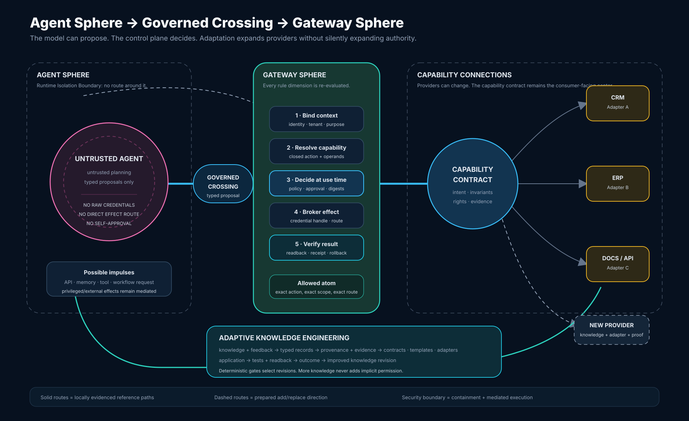

<p align="center">
  <picture>
    <source media="(prefers-color-scheme: dark)" srcset="assets/brand/chimpmaera-negative.svg">
    <source media="(prefers-color-scheme: light)" srcset="assets/brand/chimpmaera-master.svg">
    
  </picture>
</p>

# ChimpMaera

**An open, knowledge-driven operating system for governed, adaptable AI
ecosystems.**

**Governed by default. Adaptable by design. Improved through evidence.**

The current runnable release is an open-source local synthetic proof of concept;
the broader direction is not a claim of current product maturity or universal
live compatibility. It demonstrates a control plane for governed, verifiable
AI-agent actions across business systems. An agent may propose work; policy,
approval, credentials, execution, authoritative readback and receipts remain
outside the model. Stable capability and knowledge contracts make the same
intent reusable without treating a new provider as new authority.

[**Run the POC**](#quickstart) ·
[**Latest release**](https://github.com/JimPansky/ChimpMaera/releases/latest) ·
[**Watch the overview**](https://youtu.be/NZbSaHdbW1s) ·
[**How it works**](#how-it-works)

[Security and limitations](docs/SECURITY-ASSURANCE.md) ·
[Documentation hub](docs/README.md)

## How it works

- **Governed by default.** The caged Agent is an untrusted proposer. A narrow,
  typed proposal enters the Gateway, where identity, tenant, purpose, rights,
  policy and approval are evaluated at use time. A broker performs only the
  allowed atom; validation, provider readback, receipts and declared recovery
  or rollback close the loop.
- **Adaptable by design.** Stable capability and knowledge contracts separate a
  user's need from provider-specific APIs. Reusable templates supply safe
  defaults; typed adapters bind concrete fields and routes. Rights profiles,
  approval, validation and evidence remain explicit for every binding.
  AI may assist discovery, mapping, template selection, adapter/configuration
  proposals and test generation, but deterministic validators and provider
  readback decide activation truth.
- **Improved through evidence.** Governed knowledge carries provenance,
  evidence, applicability and supersession instead of becoming an
  authoritative default merely because it was observed or shared.

<p align="center">
  
</p>

Text fallback: **Agent proposal → Gateway context/capability/policy/approval
checks → brokered effect → provider readback and receipt.** Stable contracts,
templates and typed adapters connect capabilities to providers. The governed
knowledge loop is **knowledge and feedback → typed records → provenance and
evidence → contracts/templates/adapters → application → tests/readback →
outcome → improved revision**. Ingestion, confidence/verification, default
selection and execution authority are separate; unverified knowledge may
exist without becoming an authoritative default.

Solid paths are locally evidenced `SAFE_GUIDED` reference or local-synthetic
capability paths. Dashed paths are prepared add/replace product direction.
Containment plus mediated execution is the security boundary. The diagram is
not proof of generic filesystem/process/Docker mediation or universal provider
addition. See the
[combined technical architecture](docs/ARCHITECTURE.md#combined-architecture-containment-mediation-and-adaptation).

## Adaptive Knowledge Engineering

**Adaptive Knowledge Engineering** turns observations, domain knowledge,
integration behavior, tests and outcomes into versioned knowledge bound to
provenance and evidence. Candidates are validated, improved, superseded and
reused across agents, tools and systems only where their applicability and
authority boundaries fit.

**Adapt once. Validate it. Reuse it everywhere it fits.**

**Solve → Validate → Package as Knowledge → Share → Reuse → Improve**

Every integration can teach the system how to adapt the next one—without
silently expanding authority. [Governed Knowledge Harvest](docs/KNOWLEDGE-HARVEST.md)
defines the detailed lineage, maturity and promotion model.

## Proof today

- The target-neutral core is reused across the released synthetic CRM and ERP
  path: policy and approval precede the bounded effect, then semantic readback
  and a digest-bound receipt verify it. Denial, drift and replay probes fail
  closed. [Run the proof](docs/SECURE-DEFAULT-PROOF.md).
- Released Builder, HMI/harness and capability contracts cover typed discovery,
  planning, synthetic reuse, authority-free discover/explain flows and
  contribution preparation. Selected local-synthetic bindings and the
  `SAFE_GUIDED` reference path are evidence—not a live-system builder or
  production UI.
- The released foundation includes typed/provenance-bound artifacts,
  contracts, templates, adapters, verification/evidence mechanisms, and
  supersession and negative-evidence patterns. Positive evidence, negative
  probes, owner corrections and rejected variants can inform later governed
  revisions. [Explore Governed Knowledge Harvest](docs/KNOWLEDGE-HARVEST.md).

Broader live-system onboarding, provider add/replace, resource-plane adapters
and an outcome-validating autonomous learning loop across arbitrary live
systems remain direction. Provenance-bound knowledge expands an open-ended,
user-need-driven option space across system, tool and provider combinations;
each combination still needs its own applicability boundary and evidence.

## Quickstart

On a supported Linux host with Docker and Compose, run from the repository
root:

```sh
./demo/install.sh
```

Open the loopback URL printed by the installer. The demo creates local random
secrets and fictional fixtures. See the [full quickstart](docs/QUICKSTART.md)
for prerequisites and troubleshooting.

Remove only installer-owned resources:

```sh
./demo/uninstall.sh --purge
```

## Evidence and scope

- [Documentation and capability hub](docs/README.md): task-oriented routes and
  maturity labels.
- [Security Assurance](docs/SECURITY-ASSURANCE.md): exact scoped claims,
  evidence, trusted computing base and non-claims.
- [Known Limitations](docs/KNOWN-LIMITATIONS.md): production, identity,
  provider, isolation and external-evidence gaps.
- [Canon](docs/CANON.md) and [Architecture](docs/ARCHITECTURE.md): durable laws,
  trust boundaries and adapters.

This is a local synthetic PoC, not a hosted service, production release,
security certification or support promise. Use synthetic data on a disposable
or development host. Shared, ingested or unverified knowledge grants no
authority.

## Releases

- [Latest regular release](https://github.com/JimPansky/ChimpMaera/releases/latest)
- [All releases and history](https://github.com/JimPansky/ChimpMaera/releases)
- [Releases Atom feed](https://github.com/JimPansky/ChimpMaera/releases.atom)

Release pages own included capabilities, increment details, evidence boundaries,
related issues/PRs, tests, assets and SHA-256 information;
[release governance](docs/RELEASE-GOVERNANCE.md) defines publication evidence
and anonymous readback.

## Project and community

**Share what you know. Expand what everyone can build.**

- [Contribute](CONTRIBUTING.md), [get support](SUPPORT.md), or report a
  vulnerability through the [private security route](SECURITY.md).
- Watch the verified public overviews: [Why ChimpMaera?](https://youtu.be/Dq_XLEzh5I8),
  [How does it work?](https://youtu.be/w4fWgalD_WQ), and
  [Security by Default](https://youtu.be/SEPbE-EVoNs).

Videos illustrate the approach; release evidence remains in the repository
and release pages.

Code is Apache-2.0 under [LICENSE](LICENSE), [NOTICE](NOTICE) and
[THIRD_PARTY_NOTICES.md](THIRD_PARTY_NOTICES.md). Reference media follows
[MEDIA-LICENSE.md](MEDIA-LICENSE.md); Apache-2.0 grants no trademark rights.
[CITATION.cff](CITATION.cff) provides citation metadata. Community conduct and
the Developer Certificate of Origin are defined in
[CONTRIBUTING.md](CONTRIBUTING.md).

Voluntary creator support:

<p>
  <a href="https://ko-fi.com/chimpmaera"></a>
  &nbsp;
  <a href="https://buymeacoffee.com/jimpansky"></a>
</p>
