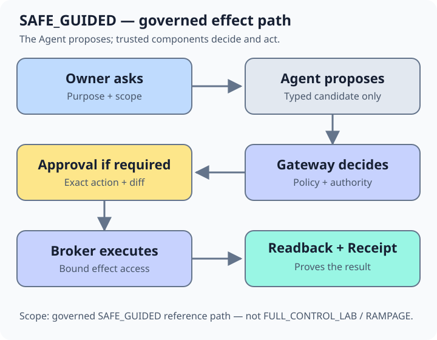

<p align="center">
  <picture>
    <source media="(prefers-color-scheme: dark)" srcset="assets/brand/chimpmaera-negative.svg">
    <source media="(prefers-color-scheme: light)" srcset="assets/brand/chimpmaera-master.svg">
    
  </picture>
</p>

# ChimpMaera

**Governed, verifiable AI-agent actions across business systems.**

ChimpMaera is an open-source local proof of concept: a control plane for governed, verifiable AI-agent actions across
business systems. Today it
demonstrates how an agent can propose cross-system work while policy, approval,
brokered execution, authoritative readback and receipts stay outside the
model. The broader direction is a vendor-neutral **Knowledge Operating System**
that turns scattered system knowledge into reusable guides, contracts and
workflows. That direction is not a claim of current product maturity.

[**Run POC**](#quickstart) ·
[**Latest release**](https://github.com/JimPansky/ChimpMaera/releases/latest) ·
[**How it works**](#how-it-works)

[Security and limitations](docs/SECURITY-ASSURANCE.md) ·
[Documentation hub](docs/README.md)

## Release status

- **Current regular Latest release:** [`v0.2.0-poc.20260803.2`](https://github.com/JimPansky/ChimpMaera/releases/tag/v0.2.0-poc.20260803.2) — **Public Truth and Discoverability Increment**.
- **Initial public baseline:** [`v0.1.0`](https://github.com/JimPansky/ChimpMaera/releases/tag/v0.1.0) — historical only; it is not the current release or its direct predecessor.

This is a local, synthetic PoC—not a production release, hosted service,
security certification, support promise or permission to connect real systems.
Use only synthetic data on a disposable or development host. See
[release governance](docs/RELEASE-GOVERNANCE.md) for publication evidence and
anonymous readback rules.

## What works today

- **Governed CRM → ERP effects:** the released loopback demo proposes a
  fictional order, applies policy and approval, executes through the bounded
  broker, then requires provider readback and a receipt. Denial, drift and
  replay probes fail closed. [Run the POC](docs/QUICKSTART.md).
- **Reusable adaptation and interfaces:** released Builder and HMI/harness
  contracts cover typed discovery, planning, synthetic reuse, and
  authority-free discover/explain flows. There is no user-facing live-system
  builder or production UI. [See maturity details](docs/README.md#extend).
- **Verification and diagnostics:** released Verification Fabric contracts
  bind checks to evidence and verdicts; Update/Doctor remains check-only and
  read-only. [Review evidence boundaries](docs/SECURITY-ASSURANCE.md).
- **Scoped identity and reads:** released Entra identity and Power Platform
  read contracts are closed and authority-free; live tenant consent, import
  and compatibility require external evidence. [Read the limitations](docs/KNOWN-LIMITATIONS.md).

## How it works

<p align="center">
  
</p>

This diagram covers only the governed `SAFE_GUIDED` reference path. In that
path the Agent is an untrusted proposer: it cannot approve itself, choose
credentials or perform the effect. `FULL_CONTROL_LAB` / `RAMPAGE` can bypass
ChimpMaera action and approval gates, inherits the host ceiling and is **not a
security boundary**.

## Quickstart

On a supported Linux host with Docker and Compose, run from the repository
root:

```sh
./demo/install.sh
```

Open the loopback URL printed by the installer. The demo creates only local
random secrets and fictional fixtures. Use the [full quickstart](docs/QUICKSTART.md)
for prerequisites and troubleshooting.

Remove only installer-owned resources:

```sh
./demo/uninstall.sh --purge
```

## Evidence and limitations

- [Documentation and capability hub](docs/README.md): task-oriented routes,
  maturity labels and document ownership.
- [Security Assurance](docs/SECURITY-ASSURANCE.md): exact scoped claims,
  evidence, TCB and non-claims.
- [Known Limitations](docs/KNOWN-LIMITATIONS.md): production, identity,
  provider, isolation and external-evidence gaps.
- [Canon](docs/CANON.md) and [Architecture](docs/ARCHITECTURE.md): durable laws
  and the current local reference design.

Shared or untrusted knowledge grants no authority. ChimpMaera does not claim a
central data lake, universal ontology, automatic publication of private data,
generic live-system integration or quantified faster onboarding.

## Project and community

- [Contribute](CONTRIBUTING.md), [get support](SUPPORT.md), or report a
  vulnerability through the [private security route](SECURITY.md).
- Watch the verified public overviews: [Why ChimpMaera?](https://youtu.be/Dq_XLEzh5I8),
  [How does it work?](https://youtu.be/w4fWgalD_WQ), and
  [Security by Default](https://youtu.be/SEPbE-EVoNs). Videos are not release
  evidence.
- Follow regular product increments through the
  [Releases Atom feed](https://github.com/JimPansky/ChimpMaera/releases.atom).

Code is Apache-2.0 under [LICENSE](LICENSE), [NOTICE](NOTICE) and
[THIRD_PARTY_NOTICES.md](THIRD_PARTY_NOTICES.md). Reference media follows
[MEDIA-LICENSE.md](MEDIA-LICENSE.md); Apache-2.0 grants no trademark rights.
[CITATION.cff](CITATION.cff) provides citation metadata. Community conduct and
the Developer Certificate of Origin are defined in [CONTRIBUTING.md](CONTRIBUTING.md).

Voluntary creator support:

<p>
  <a href="https://ko-fi.com/chimpmaera"></a>
  &nbsp;
  <a href="https://buymeacoffee.com/jimpansky"></a>
</p>
