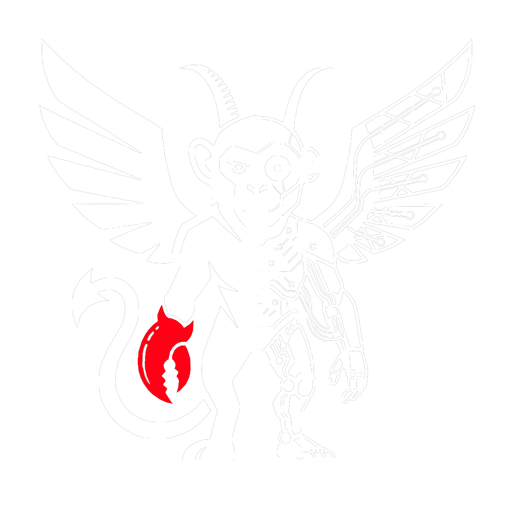

<p align="center">
  
</p>

# ChimpMaera v0.1

ChimpMaera v0.1 is a local, synthetic proof of concept for a governed
CRM-to-ERP workflow. The included installer starts an isolated loopback-only
demo with ChimpMaera, EspoCRM and Dolibarr, seeds fictional data, performs one
explicitly governed business action and verifies the result through provider
readback.

This candidate is not a production release, security certification, hosted
service, support promise or permission to connect real systems. It contains no
credentials and should be used only with synthetic data on a disposable or
development host.

**Open knowledge. Governed agency. Verifiable outcomes.**

ChimpMaera is being developed around two reinforcing product promises:

- **Governed agency:** capabilities do not become authority by accident;
  provenance, scope, policy, approval and evidence constrain every effect.
- **Open knowledge:** distributed systems, capabilities, operational knowledge
  and evidence become explainable, governable and reusable agentic workflows.

The current evidence covers the narrow local demo described above. The broader
open-source Knowledge Operating System is the product direction, not a claim
that every component below is already implemented in v0.1.

## Watch ChimpMaera

Easy Start: [Meet Your New AI Colleague | ChimpMaera](https://youtu.be/8mB7O81Y2xA)

More Infos: [How ChimpMaera Governs AI Actions | Plan, Approval, Evidence](https://youtu.be/8lj5nd-LJa4)

The Real Deal: [Controllable AI: Capability Is Not Authority | ChimpMaera](https://youtu.be/mxN9biyelZ0)

## Start here

First read [The ChimpMaera Canon](docs/CANON.md), the laws that define how
agency, authority, effects and evidence relate. Then read
[The Zoo Field Guide](docs/ZOO-FIELD-GUIDE.md) for practical application notes.

Then read [docs/QUICKSTART.md](docs/QUICKSTART.md) and run:

```sh
./demo/install.sh
```

### Connect your first system

The public v0.1 snapshot connects only the bundled synthetic EspoCRM and
Dolibarr demo. After installation, use
[Connect Your First System](docs/CONNECT-YOUR-FIRST-SYSTEM.md) to inspect that
working path and to prepare a governed connection design for another source
system. The guide separates what works in this snapshot from locally validated
but unreleased contracts and planned onboarding capabilities.

Remove only installer-owned resources with:

```sh
./demo/uninstall.sh --purge
```

The installer never needs production credentials. It creates local random
demo secrets under `.chimpmaera-demo/`; that runtime directory is ignored and
is not part of this release.

## Included areas

- `demo/`: playable installer, local runtime, synthetic fixtures and rollback.
- `assets/brand/`: the public ChimpMaera master mark used by this repository.
- `packages/`: the narrow TypeScript contract/runtime source required by the
  demo image.
- `schemas/`: public machine-readable contracts used by the candidate.
- `tests/`: focused local tests for the governed effect gate and synthetic
  fixture integrity, including the deterministic Admin-AI preview boundary.

## Knowledge that travels safely

ChimpMaera is designed to standardize understanding across distributed source
systems without requiring all operational data to be copied into one place. It
formalizes dependencies, cause and effect, context, safe use and supporting
evidence while the underlying records can remain in their systems of record.

The intended knowledge-sharing building blocks are:

- System Advisor Guides in vendor-neutral JSON, YAML or Markdown that different
  AI systems can read consistently;
- machine-readable manifests and a capability catalog;
- reusable workflow recipes and a cause/effect/context graph;
- BI semantic contracts for consistent analysis;
- tests and evidence that bind recommendations to what was actually verified;
- sanitized contribution bundles for deliberately sharing reusable knowledge.

MCP can provide an optional access channel to these artifacts, but it does not
define the knowledge. The portable Guides and contracts do.

The intended community flywheel is compact:

> integrate a system → formalize knowledge → correlate data → analyze in BI →
> derive evidence-bound recommendations → feed validated Guides and recipes
> back to the community

Security enables this exchange. Shared artifacts carry provenance, trust class
and tenant scope; redaction and owner-controlled publication protect sensitive
context; shared or untrusted content grants no authority. ChimpMaera does not
claim a central data lake, a universal ontology or automatic publication of
private company data.

## Safety boundary

All published service ports bind to loopback. Backend networks are internal,
the demo does not mount the Docker socket, and the ChimpMaera container runs
as a non-root user with a read-only root filesystem. These are local PoC
guardrails, not a hostile-host or production-security claim.

See [docs/KNOWN-LIMITATIONS.md](docs/KNOWN-LIMITATIONS.md) and
[SECURITY.md](SECURITY.md) before use. [docs/ARCHITECTURE.md](docs/ARCHITECTURE.md)
maps the shipped local implementation to the Canon without claiming production
coverage.

## Join the Zoo

Use ChimpMaera, inspect how it works, adapt it to your context and contribute
improvements through [CONTRIBUTING.md](CONTRIBUTING.md). Joining the Zoo means
participating in an open community; it does not imply company membership,
employment or authority.

Public delivery is tracked through one issue per clear, adoptable slice or
epic—not by mirroring every internal microtask. Issues, pull requests, evidence
and release notes remain linked from planning through actual publication;
`locally validated` is not `released`, and `planned` is not `proven`.

## License

Code is provided under Apache-2.0 as described in [LICENSE](LICENSE),
[NOTICE](NOTICE) and [THIRD_PARTY_NOTICES.md](THIRD_PARTY_NOTICES.md).
Bundled reference media has the narrower boundary described in
[MEDIA-LICENSE.md](MEDIA-LICENSE.md). Apache-2.0 grants no trademark rights.

Contributions are welcome under [CONTRIBUTING.md](CONTRIBUTING.md) and the
[Developer Certificate of Origin process](CONTRIBUTING.md). Community conduct
is governed by [CODE_OF_CONDUCT.md](CODE_OF_CONDUCT.md).

## Citation

Citation metadata is provided in [CITATION.cff](CITATION.cff). A directly usable
BibTeX entry is included below:

```bibtex
@software{pansky_chimpmaera,
  author = {Jim Pansky},
  title = {ChimpMaera},
  url = {https://github.com/JimPansky/ChimpMaera}
}
```

Citation is voluntary and does not replace license, notice, third-party, media
or trademark terms.

## Support

Like ChimpMaera and want to Support the Creator? Here you go:

<p>
  <a href="https://ko-fi.com/chimpmaera"></a>
  &nbsp;
  <a href="https://buymeacoffee.com/jimpansky"></a>
</p>
